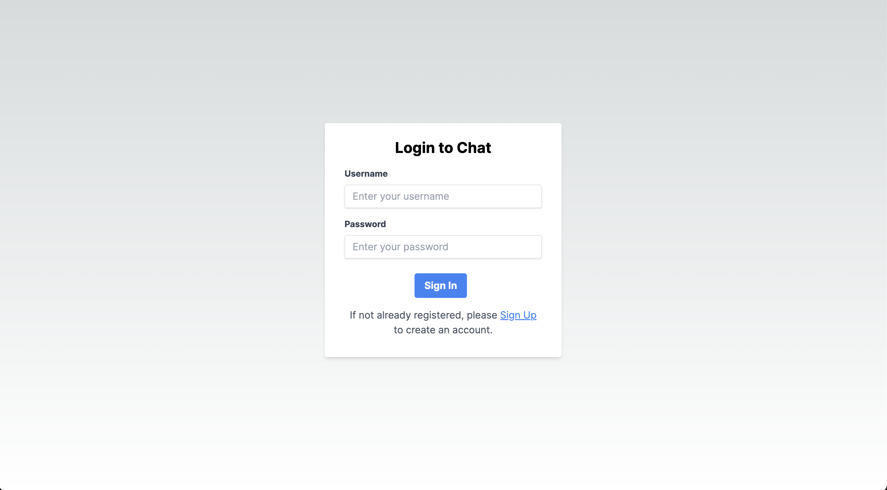
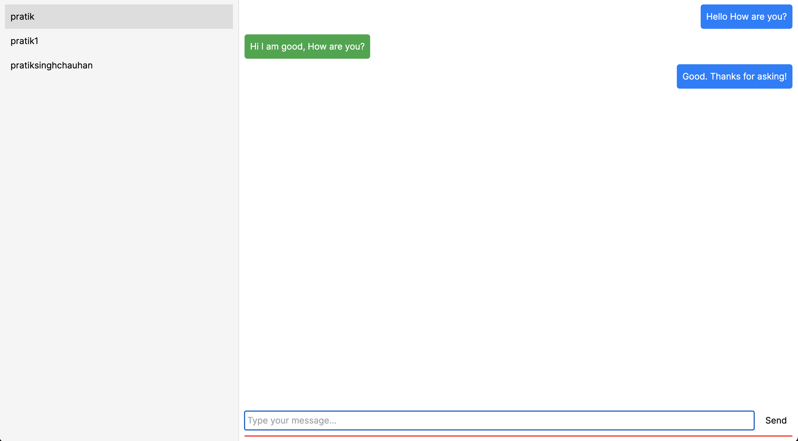

This is a [Next.js](https://nextjs.org/) frontend for the [dj-next-chat-backend](https://github.com/pratiksinghchauhan/dj-next-chat-backend)
## Getting Started

First, run the development server:

```bash
npm run dev
# or
yarn dev
# or
pnpm dev
```

Open [http://localhost:3000](http://localhost:3000) with your browser to see the result.

This project uses [`next/font`](https://nextjs.org/docs/basic-features/font-optimization) to automatically optimize and load Inter, a custom Google Font.

## Todo
- [ ] Make the UI responsive
- [ ] Add endless scrolling for messages
- [ ] Make the UI look better
- [ ] Refactor code to make it modular

## Screenshots
### Login Screen

   

### Chat Screen

   
